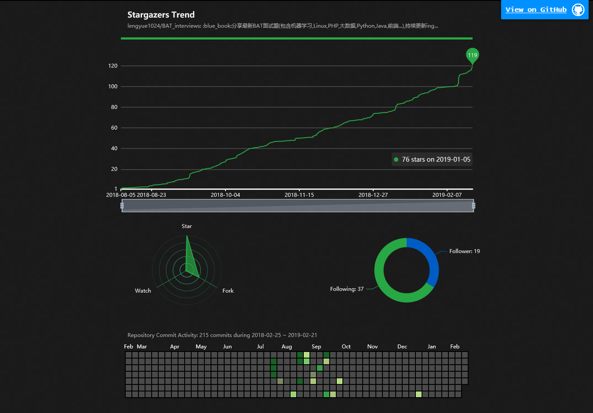

<a>「该图片截取于2019/2/21」</a>

原项目地址: <https://github.com/pingao777/github-gazer>  
本项目地址: <https://www.bingyublog.com/BAT_interviews/>  

- 该网页集成了BAT_interviews的star趋势，star、fork、watch的比例，关注本人和我关注的人的数量统计，以及BAT_interviews项目的提交记录。
- 我本人在没有破坏原项目整体样式的情况下，做了简单的样式修改。
- 为了保证原有项目的完整性，并且出于对该项目作者的尊敬，并没有太多的修改本项目。
- 你如果想使用本项目，可以直接在链接后加上`?q=github_id/repertory_name`,e.g. `https://www.bingyublog.com/BAT_interviews/?q=lengyue1024/BAT_interviews`
- 希望更多人可以关注并且向本项目提交PR.
