## 机器学习


### 1. 下列说法正确的是？（多选）


  A. AdaGrad 使用的是一阶导数


  B. L-BFGS 使用的是二阶导数


  C. AdaGrad 使用的是二阶导数


  D. L-BFGS 使用的是一阶导数


  答案：AB


  解析：AdaGrad 是基于梯度下降算法的，AdaGrad算法能够在训练中自动的对学习速率 α 进行调整，对于出现频率较低参数采用较大的 α 更新；相反，对于出现频率较高的参数采用较小的 α 更新。Adagrad非常适合处理稀疏数据。很明显，AdaGrad 算法利用的是一阶导数。

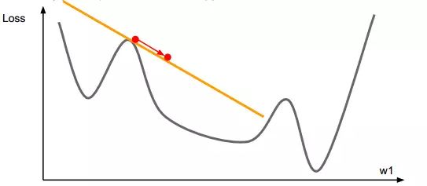  

  L-BFGS 是基于牛顿优化算法的，牛顿优化算法使用的是二阶导数。  

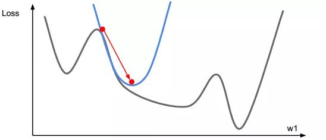

### 2. “增加卷积核的尺寸，一定能提高卷积神经网络的性能。” 这句话是否正确？

  A. 正确


  B. 错误


  答案：B


  解析：卷积核的尺寸是超参数，不一定增加其尺寸就一定增加神经网络的性能，需要验证选择最佳尺寸。


### 3. 假设你在卷积神经网络的第一层中有 5 个卷积核，每个卷积核尺寸为 7×7，具有零填充且步幅为 1。该层的输入图片的维度是 224×224×3。那么该层输出的维度是多少？


  A. 217 x 217 x 3


  B. 217 x 217 x 8


  C. 218 x 218 x 5


  D. 220 x 220 x 7


  答案：C


  解析：一般地，如果原始图片尺寸为 nxn，filter 尺寸为 fxf，则卷积后的图片尺寸为 (n-f+1)x(n-f+1)，注意 f 一般为奇数。


  若考虑存在填充和步幅，用 s 表示 stride 长度，p 表示 padding 长度，如果原始图片尺寸为 nxn，filter 尺寸为 fxf，则卷积后的图片尺寸为：

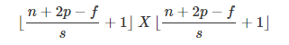

  上式中，⌊⋯⌋ 表示向下取整。


  此例中， n=224，p=0，f=7，s=1，因此，该层输出的尺寸为 218x218。


  输出的第三个维度由滤波器的个数决定，即为 5。


### 4. 假如现在有个神经网络，激活函数是 ReLU，若使用线性激活函数代替 ReLU，那么该神经网络还能表征 XNOR 函数吗？


  A. 可以


  B. 不可以


  答案：B


  解析：异或（XNOR）关系是非线性的，线性激活函数只能解决线性问题，不能解决非线性问题。如果用线性激活代替 ReLU，则神经网络失去逼近非线性函数的能力。


### 5. 机器学习训练时，Mini-Batch 的大小优选为2个的幂，如 256 或 512。它背后的原因是什么？


  A. Mini-Batch 为偶数的时候，梯度下降算法训练的更快


  B. Mini-Batch 设为 2 的 幂，是为了符合 CPU、GPU 的内存要求，利于并行化处理


  C. 不使用偶数时，损失函数是不稳定的


  D. 以上说法都不对


  答案：B


### 6. 下列哪种方法可以用来减小过拟合？（多选）


  A. 更多的训练数据


  B. L1 正则化


  C. L2 正则化


  D. 减小模型的复杂度


  答案：ABCD


  解析：增加训练样本、L1正则化、L2 正则化、减小模型复杂度都能有效避免发生过拟合。


### 7. 下列说法错误的是？


  A. 当目标函数是凸函数时，梯度下降算法的解一般就是全局最优解


  B. 进行 PCA 降维时，需要计算协方差矩阵


  C. 沿负梯度的方向一定是最优的方向


  D. 利用拉格朗日函数能解带约束的优化问题


  答案：C


  解析：沿负梯度的方向是函数值减少最快的方向但不一定就是最优方向。


### 8. K-Means 算法无法聚以下哪种形状的样本？


  A. 圆形分布


  B. 螺旋分布


  C. 带状分布


  D. 凸多边形分布


  答案：B


  解析：K-Means 算法是基于距离测量的，无法聚非凸形状的样本。


### 9. 向量 X=[1,2,3,4,-9,0] 的 L1 范数为？


  A. 1


  B. 19


  C. 6


  D. √111


  答案：B


  解析：L0 范数表示向量中所有非零元素的个数；L1 范数指的是向量中各元素的绝对值之和，又称“稀疏矩阵算子”；L2 范数指的是向量中各元素的平方和再求平方根。


  本例中，L0 范数为 5，L1 范数为 19，L2 范数为 √111。


### 10. 关于 L1、L2 正则化下列说法正确的是？


  A. L2 正则化能防止过拟合，提升模型的泛化能力，但 L1 做不到这点


  B. L2 正则化技术又称为 Lasso Regularization


  C. L1 正则化得到的解更加稀疏


  D. L2 正则化得到的解更加稀疏


  答案：C


  解析：L1、L2 正则化都能防止过拟合，提升模型的泛化能力。L1 正则化技术又称为 Lasso Regularization。L1 正则化得到的解更加稀疏，如下图所示：

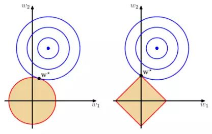

  以二维情况讨论，上图左边是 L2 正则化，右边是 L1 正则化。从另一个方面来看，满足正则化条件，实际上是求解蓝色区域与黄色区域的交点，即同时满足限定条件和 Ein 最小化。对于 L2 来说，限定区域是圆，这样，得到的解 w1 或 w2 为 0 的概率很小，很大概率是非零的。


  对于 L1 来说，限定区域是正方形，方形与蓝色区域相交的交点是顶点的概率很大，这从视觉和常识上来看是很容易理解的。也就是说，方形的凸点会更接近 Ein 最优解对应的 wlin 位置，而凸点处必有 w1 或 w2 为 0。这样，得到的解 w1 或 w2 为零的概率就很大了。所以，L1 正则化的解具有稀疏性。


  扩展到高维，同样的道理，L2 的限定区域是平滑的，与中心点等距；而 L1 的限定区域是包含凸点的，尖锐的。这些凸点更接近 Ein 的最优解位置，而在这些凸点上，很多 wj 为 0。


### 11. 有 N 个样本，一般用于训练，一般用于测试。若增大 N 值，则训练误差和测试误差之间的差距会如何变化？


  A. 增大


  B. 减小


  答案：B


  解析：增加数据，能够有效减小过拟合，减小训练样本误差和测试样本误差之间的差距。


### 12. 假定你在神经网络中的隐藏层中使用激活函数 X。在特定神经元给定任意输入，你会得到输出 -0.01。X 可能是以下哪一个激活函数？


  A. ReLU


  B. tanh


  C. Sigmoid


  D. 以上都有可能


  答案：B


  解析：ReLU 的输出范围是 [0,+∞)，tanh 的输出范围是 (-1,+1)，Sigmoid 的输出范围是 (0,+1)。


### 13. k-NN 最近邻方法在什么情况下效果较好？


  A. 样本较多但典型性不好


  B. 样本较少但典型性好


  C. 样本呈团状分布


  D. 样本呈链状分布


  答案：B


  解析：K 近邻算法主要依靠的是周围的点，因此如果样本过多，则难以区分，典型性好的容易区分。


  样本呈团状或链状都具有迷惑性，这样 kNN 就发挥不出其求近邻的优势了，整体样本应该具有典型性好，样本较少，比较适宜。


### 14. 下列方法中，可以用于特征降维的方法包括？（多选）


  A. 主成分分析 PCA


  B. 线性判别分析 LDA


  C. AutoEncoder


  D. 矩阵奇异值分解 SVD


  E. 最小二乘法 LeastSquares


  答案：ABCD


  解析：主成分分析 PCA 、线性判别分析 LDA 、AutoEncoder、矩阵奇异值分解 SVD 都是用于特征降维的方法。最小二乘法是解决线性回归问题的算法，但是并没有进行降维。


### 15. 以下哪些方法不可以直接来对文本分类？


  A. K-Means


  B. 决策树


  C. 支持向量机


  D. kNN


  答案：A


  解析：K-Means 是无监督算法，它之所以不能称为分类是因为它之前并没有类别标签，因此只能聚类。


### 16. 在回归模型中，下列哪一项在权衡欠拟合（under-fitting）和过拟合（over-fitting）中影响最大？


  A. 多项式阶数


  B. 更新权重 w 时，使用的是矩阵求逆还是梯度下降


  C. 使用常数项


  答案：A


  解析：选择合适的多项式阶数非常重要。如果阶数过大，模型就会更加复杂，容易发生过拟合；如果阶数较小，模型就会过于简单，容易发生欠拟合。如果有对过拟合和欠拟合概念不清楚的，见下图所示：

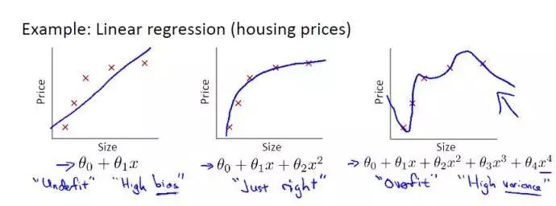   

### 17. 假设你有以下数据：输入和输出都只有一个变量。使用线性回归模型（y=wx+b）来拟合数据。那么使用留一法（Leave-One Out）交叉验证得到的均方误差是多少？

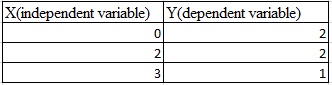

  A. 10/27


  B. 39/27


  C. 49/27


  D. 55/27


  答案：C


  解析：留一法，简单来说就是假设有 N 个样本，将每一个样本作为测试样本，其它 N-1 个样本作为训练样本。这样得到 N 个分类器，N 个测试结果。用这 N个结果的平均值来衡量模型的性能。


  对于该题，我们先画出 3 个样本点的坐标：

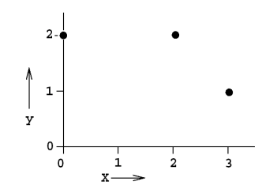

  使用两个点进行线性拟合，分成三种情况，如下图所示：

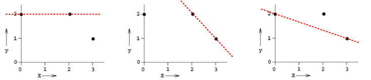

  第一种情况下，回归模型是 y = 2，误差 E1 = 1。


  第二种情况下，回归模型是 y = -x + 4，误差 E2 = 2。


  第三种情况下，回归模型是 y = -1/3x + 2,误差 E3 = 2/3。


  则总的均方误差为：

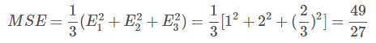

### 18. 下列关于极大似然估计（Maximum Likelihood Estimate，MLE），说法正确的是（多选）？


  A. MLE 可能并不存在


  B. MLE 总是存在


  C. 如果 MLE 存在，那么它的解可能不是唯一的


  D. 如果 MLE 存在，那么它的解一定是唯一的


  答案：AC


  解析：如果极大似然函数 L(θ) 在极大值处不连续，一阶导数不存在，则 MLE 不存在，如下图所示：

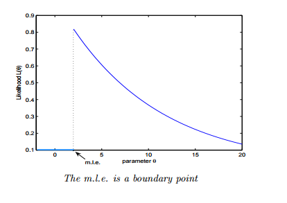

另一种情况是 MLE 并不唯一，极大值对应两个 θ。如下图所示：  

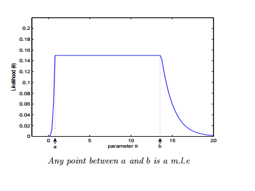

### 19. 如果我们说“线性回归”模型完美地拟合了训练样本（训练样本误差为零），则下面哪个说法是正确的？


  A. 测试样本误差始终为零


  B. 测试样本误差不可能为零


  C. 以上答案都不对


  答案：C


  解析：根据训练样本误差为零，无法推断测试样本误差是否为零。值得一提是，如果测试样本样本很大，则很可能发生过拟合，模型不具备很好的泛化能力！


### 20. 在一个线性回归问题中，我们使用 R 平方（R-Squared）来判断拟合度。此时，如果增加一个特征，模型不变，则下面说法正确的是？


  A. 如果 R-Squared 增加，则这个特征有意义


  B. 如果R-Squared 减小，则这个特征没有意义


  C. 仅看 R-Squared 单一变量，无法确定这个特征是否有意义。


  D. 以上说法都不对


  答案：C


解析：线性回归问题中，R-Squared 是用来衡量回归方程与真实样本输出之间的相似程度。其表达式如下所示：


上式中，分子部分表示真实值与预测值的平方差之和，类似于均方差 MSE；分母部分表示真实值与均值的平方差之和，类似于方差 Var。根据 R-Squared 的取值，来判断模型的好坏：如果结果是 0，说明模型拟合效果很差；如果结果是 1，说明模型无错误。一般来说，R-Squared 越大，表示模型拟合效果越好。R-Squared 反映的是大概有多准，因为，随着样本数量的增加，R-Square必然增加，无法真正定量说明准确程度，只能大概定量。


  对于本题来说，单独看 R-Squared，并不能推断出增加的特征是否有意义。通常来说，增加一个特征，R-Squared 可能变大也可能保持不变，两者不一定呈正相关。


  如果使用校正决定系数（Adjusted R-Square）：

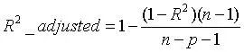

  其中，n 是样本数量，p 是特征数量。Adjusted R-Square 抵消样本数量对 R-Square的影响，做到了真正的 0~1，越大越好。

### 21. 下列关于线性回归分析中的残差（Residuals）说法正确的是？


  A. 残差均值总是为零


  B. 残差均值总是小于零


  C. 残差均值总是大于零


  D. 以上说法都不对


  答案：A


  解析：线性回归分析中，目标是残差最小化。残差平方和是关于参数的函数，为了求残差极小值，令残差关于参数的偏导数为零，会得到残差和为零，即残差均值为零。

### 22. 下列关于异方差（Heteroskedasticity）说法正确的是？


  A. 线性回归具有不同的误差项


  B. 线性回归具有相同的误差项


  C. 线性回归误差项为零


  D. 以上说法都不对


  答案：A


  解析：异方差性是相对于同方差（Homoskedasticity）而言的。所谓同方差，是为了保证回归参数估计量具有良好的统计性质，经典线性回归模型的一个重要假定：总体回归函数中的随机误差项满足同方差性，即它们都有相同的方差。如果这一假定不满足，即：随机误差项具有不同的方差，则称线性回归模型存在异方差性。


  通常来说，奇异值的出现会导致异方差性增大。

### 23. 下列哪一项能反映出 X 和 Y 之间的强相关性？


  A. 相关系数为 0.9


  B. 对于无效假设 β=0 的 p 值为 0.0001


  C. 对于无效假设 β=0 的 t 值为 30


  D. 以上说法都不对


  答案：A


  解析：相关系数的概念我们很熟悉，它反映了不同变量之间线性相关程度，一般用 r 表示。

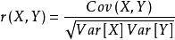

  其中，Cov(X,Y) 为 X 与 Y 的协方差，Var[X] 为 X 的方差，Var[Y] 为 Y 的方差。r 取值范围在 [-1,1] 之间，r 越大表示相关程度越高。A 选项中，r=0.9 表示 X 和 Y 之间有较强的相关性。


  而 p 和 t 的数值大小没有统计意义，只是将其与某一个阈值进行比对,以得到二选一的结论。例如，有两个假设：

- 无效假设（null hypothesis）H0：两参量间不存在“线性”相关。

- 备择假设（alternative hypothesis）H1：两参量间存在“线性”相关。

  如果阈值是 0.05，计算出的 p 值很小，比如为 0.001，则可以说“有非常显著的证据拒绝 H0 假设,相信 H1 假设。即两参量间存在“线性”相关。p 值只用于二值化判断，因此不能说 p=0.06 一定比 p=0.07 更好。

### 24. 下列哪些假设是我们推导线性回归参数时遵循的（多选）？


  A. X 与 Y 有线性关系（多项式关系）


  B. 模型误差在统计学上是独立的


  C. 误差一般服从 0 均值和固定标准差的正态分布


  D. X 是非随机且测量没有误差的


  答案：ABCD


  解析：在进行线性回归推导和分析时，我们已经默认上述四个条件是成立的。

### 25. 为了观察测试 Y 与 X 之间的线性关系，X 是连续变量，使用下列哪种图形比较适合？


  A. 散点图


  B. 柱形图


  C. 直方图


  D. 以上都不对


  答案：A


  解析：散点图反映了两个变量之间的相互关系，在测试 Y 与 X 之间的线性关系时，使用散点图最为直观。

### 26. 一般来说，下列哪种方法常用来预测连续独立变量？


  A. 线性回归


  B. 逻辑回顾


  C. 线性回归和逻辑回归都行


  D. 以上说法都不对


  答案：A


  解析：线性回归一般用于实数预测，逻辑回归一般用于分类问题。

### 27. 个人健康和年龄的相关系数是 -1.09。根据这个你可以告诉医生哪个结论？


  A. 年龄是健康程度很好的预测器


  B. 年龄是健康程度很糟的预测器


  C. 以上说法都不对


  答案：C


  解析：因为相关系数的范围是 [-1,1] 之间，所以，-1.09 不可能存在。

### 28. 下列哪一种偏移，是我们在最小二乘直线拟合的情况下使用的？图中横坐标是输入 X，纵坐标是输出 Y。

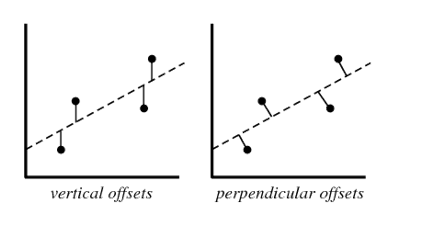

  A. 垂直偏移（vertical offsets）


  B. 垂向偏移（perpendicular offsets）


  C. 两种偏移都可以


  D. 以上说法都不对


  答案：A


  解析：线性回归模型计算损失函数，例如均方差损失函数时，使用的都是 vertical offsets。perpendicular offsets 一般用于主成分分析（PCA）中。

### 29. 假如我们利用 Y 是 X 的 3 阶多项式产生一些数据（3 阶多项式能很好地拟合数据）。那么，下列说法正确的是（多选）？


  A. 简单的线性回归容易造成高偏差（bias）、低方差（variance）


  B. 简单的线性回归容易造成低偏差（bias）、高方差（variance）


  C. 3 阶多项式拟合会造成低偏差（bias）、高方差（variance）


  D. 3 阶多项式拟合具备低偏差（bias）、低方差（variance）


  答案：AD


  解析：偏差和方差是两个相对的概念，就像欠拟合和过拟合一样。如果模型过于简单，通常会造成欠拟合，伴随着高偏差、低方差；如果模型过于复杂，通常会造成过拟合，伴随着低偏差、高方差。


  用一张图来形象地表示偏差与方差的关系：

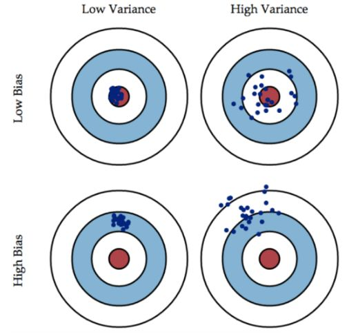

图片来源：https://www.zhihu.com/question/27068705

偏差（bias）可以看成模型预测与真实样本的差距，想要得到 low bias，就得复杂化模型，但是容易造成过拟合。方差（variance）可以看成模型在测试集上的表现，想要得到 low variance，就得简化模型，但是容易造成欠拟合。实际应用中，偏差和方差是需要权衡的。若模型在训练样本和测试集上都表现的不错，偏差和方差都会比较小，这也是模型比较理想的情况。

### 30. 假如你在训练一个线性回归模型，有下面两句话：


      1. 如果数据量较少，容易发生过拟合。

      2. 如果假设空间较小，容易发生过拟合。

关于这两句话，下列说法正确的是？

  A. 1 和 2 都错误


  B. 1 正确，2 错误


  C. 1 错误，2 正确


  D. 1 和 2 都正确


  答案：B


  解析：先来看第 1 句话，如果数据量较少，容易在假设空间找到一个模型对训练样本的拟合度很好，容易造成过拟合，该模型不具备良好的泛化能力。


  再来看第 2 句话，如果假设空间较小，包含的可能的模型就比较少，也就不太可能找到一个模型能够对样本拟合得很好，容易造成高偏差、低方差，即欠拟合。

### 31. 假如我们使用 Lasso 回归来拟合数据集，该数据集输入特征有 100 个（X1，X2，...，X100）。现在，我们把其中一个特征值扩大 10 倍（例如是特征 X1），然后用相同的正则化参数对 Lasso 回归进行修正。


  那么，下列说法正确的是？


  A. 特征 X1 很可能被排除在模型之外


  B. 特征 X1 很可能还包含在模型之中


  C. 无法确定特征 X1 是否被舍弃


  D. 以上说法都不对


  答案： B


  解析：Lasso 回归类似于线性回归，只不过它在线性回归的基础上，增加了一个对所有参数的数值大小约束，如下所示：

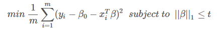

  其中，t 为正则化参数。Lasso 回归其实就是在普通线性回归的损失函数的基础上增加了个 β 的约束。那么 β 的约束为什么要使用这种形式，而不使用 β 的平方约束呢？原因就在于第一范数的约束下，一部分回归系数刚好可以被约束为 0。这样的话，就达到了特征选择的效果。如下图所示：

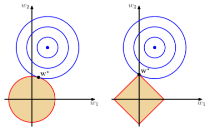

  左边是第二范式，右边是第一范式。第一范数约束下，β 更有可能被约束成 0。这点非常类似于 L1 和 L2 正则化的区别。

  因此，Lasso 回归适用于样本数量较少，特征维度较大的情形，便于从较多特征中进行特征选择。例如 DNA 数据，特征维度很大，我们只希望通过 Lasso 回归找出与某些疾病有关的 DNA 片段。


  本题中，将特征 X1 数值扩大 10 倍，他对应的回归系数将相应会减小，但不为 0，以此来保证仍然满足 β 的正则化约束。

### 32. 关于特征选择，下列对 Ridge 回归和 Lasso 回归说法正确的是？


  A. Ridge 回归适用于特征选择


  B. Lasso 回归适用于特征选择


  C. 两个都适用于特征选择


  D. 以上说法都不对


  答案：B


  解析：上一题我们已经介绍过，Lasso 回归会让一部分回归系数刚好可以被约束为 0，起到特征选择的效果。


  Ridge 回归又称岭回归，它是普通线性回归加上 L2 正则项，用来防止训练过程中出现的过拟合。L2 正则化效果类似上一题左图，限定区域是圆，这样，得到的回归系数为 0 的概率很小，很大概率是非零的。因此，比较来说，Lasso 回归更容易得到稀疏的回归系数，有利于舍弃冗余或无用特征，适用于特征选择。

### 33. 如果在线性回归模型中增加一个特征变量，下列可能发生的是（多选）？


  A. R-squared 增大，Adjust R-squared 增大


  B. R-squared 增大，Adjust R-squared 减小


  C. R-squared 减小，Adjust R-squared 减小


  D. R-squared 减小，Adjust R-squared 增大


  答案：AB


  解析：线性回归问题中，R-Squared 是用来衡量回归方程与真实样本输出之间的相似程度。其表达式如下所示：

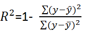

  上式中，分子部分表示真实值与预测值的平方差之和，类似于均方差 MSE；分母部分表示真实值与均值的平方差之和，类似于方差 Var。一般来说，R-Squared 越大，表示模型拟合效果越好。R-Squared 反映的是大概有多准，因为，随着样本数量的增加，R-Squared 必然增加，无法真正定量说明准确程度，只能大概定量。


  单独看 R-Squared，并不能推断出增加的特征是否有意义。通常来说，增加一个特征特征，R-Squared 可能变大也可能保持不变，两者不一定呈正相关。


  如果使用校正决定系数（Adjusted R-Squared）：


  其中，n 是样本数量，p 是特征数量。Adjusted R-Squared 抵消样本数量对 R-Squared 的影响，做到了真正的 0~1，越大越好。


  增加一个特征变量，如果这个特征有意义，Adjusted R-Square 就会增大，若这个特征是冗余特征，Adjusted R-Squared 就会减小。

### 34. 下面三张图展示了对同一训练样本，使用不同的模型拟合的效果（蓝色曲线）。那么，我们可以得出哪些结论（多选）？

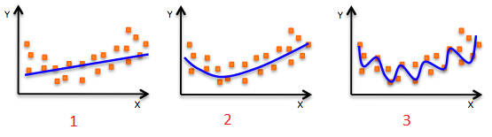

  A. 第 1 个模型的训练误差大于第 2 个、第 3 个模型


  B. 最好的模型是第 3 个，因为它的训练误差最小


  C. 第 2 个模型最为“健壮”，因为它对未知样本的拟合效果最好


  D. 第 3 个模型发生了过拟合


  E. 所有模型的表现都一样，因为我们并没有看到测试数据


  答案：ACD


  解析：1、2、3 模型分别对应的多项式阶数由小到大，即模型由简单到复杂。模型越简单，容易发生欠拟合；模型越复杂，容易发生过拟合。第 1 个模型过于简单，出现欠拟合；第 3 个模型过于复杂，对训练样本拟合得很好，但在测试样本上效果会很差，即过拟合；第 2 个模型最为“健壮”，在训练样本和测试样本上拟合效果都不错！

### 35. 下列哪些指标可以用来评估线性回归模型（多选）？


  A. R-Squared


  B. Adjusted R-Squared


  C. F Statistics


  D. RMSE / MSE / MAE


  答案：ABCD


  解析：R-Squared 和 Adjusted R-Squared 的概念，我们在 Q3 有过介绍，它们都可以用来评估线性回归模型。F Statistics 是指在零假设成立的情况下，符合F分布的统计量，多用于计量统计学中。


  RMSE 指的是均方根误差：

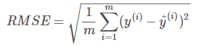

  MSE 指的是均方误差：

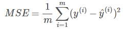

  MAE 指的是评价绝对误差：

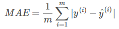

  以上指标都可以用来评估线性回归模型。

### 36. 线性回归中，我们可以使用正规方程（Normal Equation）来求解系数。下列关于正规方程说法正确的是？


  A. 不需要选择学习因子


  B. 当特征数目很多的时候，运算速度会很慢


  C. 不需要迭代训练


  答案：ABC


  解析：求解线性回归系数，我们一般最常用的方法是梯度下降，利用迭代优化的方式。除此之外，还有一种方法是使用正规方程，原理是基于最小二乘法。下面对正规方程做简要的推导。


  已知线性回归模型的损失函数 Ein 为：

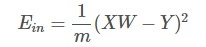

  对 Ein 计算导数，令 ∇Ein=0：


  然后就能计算出 W：

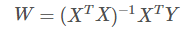

  以上就是使用正规方程求解系数 W 的过程。可以看到，正规方程求解过程不需要学习因子，也没有迭代训练过程。当特征数目很多的时候，XTX 矩阵求逆会很慢，这时梯度下降算法更好一些。


  如果 XTX 矩阵不可逆，是奇异矩阵怎么办呢？其实，大部分的计算逆矩阵的软件程序，都可以处理这个问题，也会计算出一个逆矩阵。所以，一般伪逆矩阵是可解的。

### 37. 如果 Y 是 X（X1，X2，...，Xn）的线性函数：


  Y = β0 + β1X1 + β2X2 + ··· + βnXn


  则下列说法正确的是（多选）？


  A. 如果变量 Xi 改变一个微小变量 ΔXi，其它变量不变。那么 Y 会相应改变 βiΔXi。


  B. βi 是固定的，不管 Xi 如何变化


  C. Xi 对 Y 的影响是相互独立的，且 X 对 Y 的总的影响为各自分量 Xi 之和


  答案：ABC


  解析：这题非常简单，Y 与 X（X1，X2，...，Xn）是线性关系，故能得出 ABC 结论。

### 38. 构建一个最简单的线性回归模型需要几个系数（只有一个特征）？


  A. 1 个


  B. 2 个


  C. 3 个


  D. 4 个


  答案：B


  解析：最简单的线性回归模型，只有一个特征，即 Y = aX + b，包含 a 和 b 两个系数。

### 39. 下面两张图展示了两个拟合回归线（A 和 B），原始数据是随机产生的。现在，我想要计算 A 和 B 各自的残差之和。注意：两种图中的坐标尺度一样。

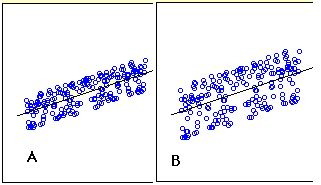

  关于 A 和 B 各自的残差之和，下列说法正确的是？


  A. A 比 B 高


  B. A 比 B 小


  C. A 与 B 相同


  D. 以上说法都不对


  答案：C


  解析：A 和 B 中各自的残差之和应该是相同的。线性回归模型的损失函数为：

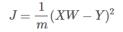

  对损失函数求导，并令 ∇J=0，即可得到 XW-Y=0，即残差之和始终为零。

### 40. 如果两个变量相关，那么它们一定是线性关系吗？


  A. 是


  B. 不是


  答案：B


  解析：相关不一定是线性关系，也有可能是非线性相关。

### 41. 两个变量相关，它们的相关系数 r 可能为 0。这句话是否正确？


  A. 正确


  B. 错误


  答案：A


  解析：一般来说，相关系数 r=0 是两变量相互独立的必要不充分条件。也就是说，如果两个变量相互独立，那么相关系数 r 一定为 0，如果相关系数 r=0，则不一定相互独立。相关系数 r=0 只能说明两个变量之间不存在线性关系，仍然可能存在非线性关系。


  那么，若两个变量相关，存在非线性关系，那么它们的相关系数 r 就为 0。

### 42. 加入使用逻辑回归对样本进行分类，得到训练样本的准确率和测试样本的准确率。现在，在数据中增加一个新的特征，其它特征保持不变。然后重新训练测试。则下列说法正确的是？


  A. 训练样本准确率一定会降低


  B. 训练样本准确率一定增加或保持不变


  C. 测试样本准确率一定会降低


  D. 测试样本准确率一定增加或保持不变


  答案：B


  解析：在模型中增加更多特征一般会增加训练样本的准确率，减小 bias。但是测试样本准确率不一定增加，除非增加的特征是有效特征。


  这题对应的知识点也包括了增加模型复杂度，虽然会减小训练样本误差，但是容易发生过拟合。

### 43. 下面这张图是一个简单的线性回归模型,图中标注了每个样本点预测值与真实值的残差。计算 SSE 为多少？

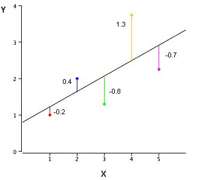

  A. 3.02


  B. 0.75


  C. 1.01


  D. 0.604


  答案：A


  解析：SSE 是平方误差之和（Sum of Squared Error），SSE = (-0.2)^2 + (0.4)^2 + (-0.8)^2 + (1.3)^2 + (-0.7)^2 = 3.02

### 44. 假设变量 Var1 和 Var2 是正相关的，那么下面那张图是正确的？图中，横坐标是 Var1，纵坐标是 Var2，且对 Var1 和 Var2 都做了标准化处理。

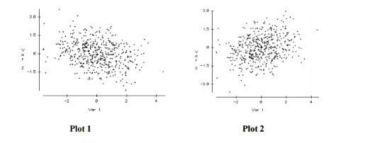

  A. Plot 1


  B. Plot 2


  答案：B


  解析：显然，Plot 2 显示出 Var2 与 Var1 是正相关的，例如 Var2 = Var1。Plot 1 显示出 Var2 与 Var1 是负相关的，例如 Var2 = -Var1。

### 45. 假设一个公司的薪资水平中位数是 $35,000，排名第 25% 和 75% 的薪资分别是 $21,000 和 $ 53,000。如果某人的薪水是 $1，那么它可以被看成是异常值（Outlier）吗？

  A. 可以

  B. 不可以

  C. 需要更多的信息才能判断

  D. 以上说法都不对


  答案：C

  解析：异常值（Outlier）指样本中的个别值，其数值明显偏离它（或他们）所属样本的其余观测值，也称异常数据，离群值。目前人们对异常值的判别与剔除主要采用物理判别法和统计判别法两种方法。

  所谓物理判别法就是根据人们对客观事物已有的认识，判别由于外界干扰、人为误差等原因造成实测数据值偏离正常结果，在实验过程中随时判断，随时剔除。

  统计判别法是给定一个置信概率，并确定一个置信限，凡超过此限的误差，就认为它不属于随机误差范围，将其视为异常值剔除。当物理识别不易判断时，一般采用统计识别法。

  该题中，所给的信息量过少，无法肯定一定是异常值。

### 46. 关于“回归（Regression）”和“相关（Correlation）”，下列说法正确的是？注意：x 是自变量，y 是因变量。


  A. 回归和相关在 x 和 y 之间都是互为对称的


  B. 回归和相关在 x 和 y 之间都是非对称的


  C. 回归在 x 和 y 之间是非对称的，相关在 x 和 y 之间是互为对称的


  D. 回归在 x 和 y 之间是对称的，相关在 x 和 y 之间是非对称的


  答案：D


  解析：相关（Correlation）是计算两个变量的线性相关程度，是对称的。也就是说，x 与 y 的相关系数和 y 与 x 的相关系数是一样的，没有差别。


  回归（Regression）一般是利用 特征 x 预测输出 y，是单向的、非对称的。

### 47. 仅仅知道变量的均值（Mean）和中值（Median），能计算的到变量的偏斜度（Skewness）吗？


  A. 可以


  B. 不可以


  答案：B


  解析：偏斜度是对统计数据分布偏斜方向及程度的度量。偏斜度是利用 3 阶矩定义的，其计算公式如下：


  其中，n 是样本数量。统计数据的频数分布有的是对称的，有的是不对称的，即呈现偏态。在偏态分布中，当偏斜度为正值时，分布正偏，即众数位于算术平均数的左侧；当偏斜度为负值时，分布负偏，即众数位于算术平均数的右侧。


  我们可以利用众数、中位数和算术平均数之间的关系判断分布是左偏态还是右偏态，但要度量分布偏斜的程度，就需要计算偏斜度了。

### 48. 假设有 n 组数据集，每组数据集中，x 的平均值都是 9，x 的方差都是 11，y 的平均值都是 7.50，x 与 y 的相关系数都是 0.816，拟合的线性回归方程都是 y = 3.00 + 0.500*x。那么这 n 组数据集是否一样？

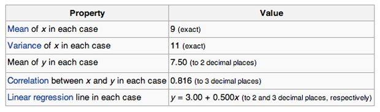

  A. 一样


  B. 不一样


  C. 无法确定


  答案：C


  解析：这里需要知道的是 Anscombe's quartet。1973年，统计学家F.J. Anscombe 构造出了四组奇特的数据。这四组数据中，x 值的平均数都是 9.0，y 值的平均数都是 7.5；x 值的方差都是 10.0，y值的方差都是 3.75；它们的相关度都是 0.816，线性回归线都是 y=3+0.5x。单从这些统计数字上看来，四组数据所反映出的实际情况非常相近，而事实上，这四组数据有着天壤之别，如下图所示：


  相应的 Python 代码为：

``` python
  import seaborn as sns

  sns.set(style="ticks")
  # Load the example dataset for Anscombe's quartet
  df = sns.load_dataset("anscombe")
  # Show the results of a linear regression within each dataset
  sns.lmplot(x="x", y="y", col="dataset", hue="dataset", data=df,
           col_wrap=2, ci=None, palette="muted", size=4,
           scatter_kws={"s": 50, "alpha": 1})
```
### 49. 观察样本次数如何影响过拟合（多选）？注意：所有情况的参数都保持一致。


  A. 观察次数少，容易发生过拟合


  B. 观察次数少，不容易发生过拟合


  C. 观察次数多，容易发生过拟合


  D. 观察次数多，不容易发生过拟合


  答案：AD


  解析：如果样本观察次数较少，且样本数量较少，通过提高模型复杂度，例如多项式阶数，很容易对所有样本点都拟合的非常好，造成过拟合。但是，如果观察次数多，样本更具有代表性，这时候，即使模型复杂，也不容易发生过拟合，得到的模型能够较真实地反映真实的数据分布。

### 50. 假如使用一个较复杂的回归模型来拟合样本数据，使用 Ridge 回归，调试正则化参数 λ，来降低模型复杂度。若 λ 较大时，关于偏差（bias）和方差（variance），下列说法正确的是？


  A. 若 λ 较大时，偏差减小，方差减小


  B. 若 λ 较大时，偏差减小，方差增大


  C. 若 λ 较大时，偏差增大，方差减小


  D. 若 λ 较大时，偏差增大，方差增大


  答案：C


  解析：若 λ 较大时，意味着模型复杂度较低，这时候容易发生欠拟合，对应偏差增大，方差减小。做个简单总结：


      - λ 较小：偏差减小，方差增大，容易发生过拟合

      - λ 较大：偏差增大，方差减小，容易发生欠拟合
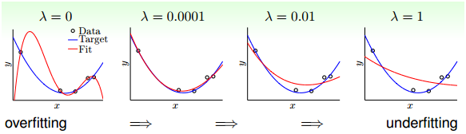

### 51. 假如使用一个较复杂的回归模型来拟合样本数据，使用 Ridge 回归，调试正则化参数 λ，来降低模型复杂度。若 λ 较小时，关于偏差（bias）和方差（variance），下列说法正确的是？


  A. 若 λ 较小时，偏差减小，方差减小


  B. 若 λ 较小时，偏差减小，方差增大


  C. 若 λ 较小时，偏差增大，方差减小


  D. 若 λ 较小时，偏差增大，方差增大


  答案：B


  解析：见 题5。

### 52. 下列关于 Ridge 回归，说法正确的是（多选）？


  A. 若 λ=0，则等价于一般的线性回归


  B. 若 λ=0，则不等价于一般的线性回归


  C. 若 λ=+∞，则得到的权重系数很小，接近于零


  D. 若 λ=+∞，则得到的权重系数很大，接近与无穷大


  答案：AC


  解析：若 λ=0，即没有正则化项，等价于一般的线性回归，可以使用最小二乘法求解系数。若 λ=+∞，正则化项对权重系数的“惩罚”非常大，对应得到的权重系数很小，接近于零。

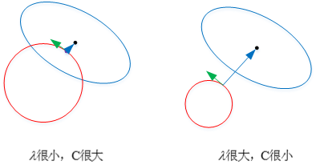

  关于正则化的图形化解释，请参考我的这篇文章：

[机器学习中 L1 和 L2 正则化的直观解释](https://mp.weixin.qq.com/s?__biz=MzIwOTc2MTUyMg==&mid=2247484510&idx=1&sn=d7df438e67e460ee4f30df1310d22147&chksm=976fa1c3a01828d54c8b715851b5ce3bf2e63cb601a98a296228f4a0b98829e0b1b779fc1b68&scene=21#wechat_redirect)

### 53. 在下面给出的三个残差图中，下面哪一个代表了与其他模型相比更差的模型？


  注意：


  1. 所有的残差都已经标准化


  2. 图中横坐标是预测值，纵坐标是残差

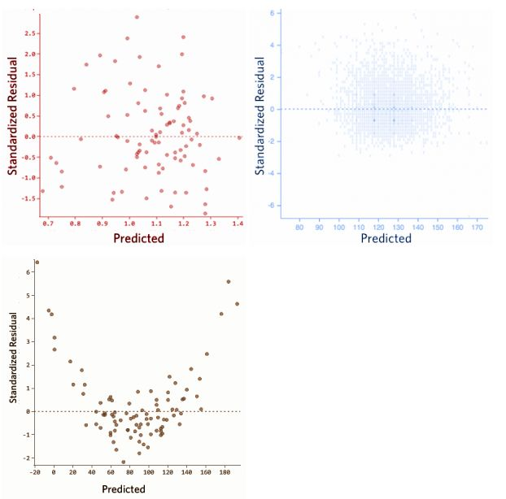

  A. 1


  B. 2


  C. 3


  D. 无法比较


  答案：C


  解析：预测值与残差之间不应该存在任何函数关系，若存在函数关系，表明模型拟合的效果并不很好。对应在图中，若横坐标是预测值，纵坐标是残差，残差应表现为与预测值无关的随机分布。但是，图 3 中残差与预测值呈二次函数关系，表明该模型并不理想。

### 54. 下列哪一种方法的系数没有封闭形式（closed-form）的解？

  A. Ridge 回归

  B. Lasso

  C. Ridge 回归和 Lasso

  D. 以上都不是

  答案：B

  解析：Ridge 回归是一般的线性回归再加上 L2 正则项，它具有封闭形式的解，可以基于最小二乘法求解  

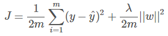

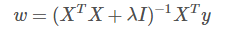

  Lasso 回归是一般的线性回归再加上 L1 正则项，L1 正则项使解是非线性的，没有封闭形式的解。
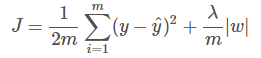

### 55. 观察如下数据集：

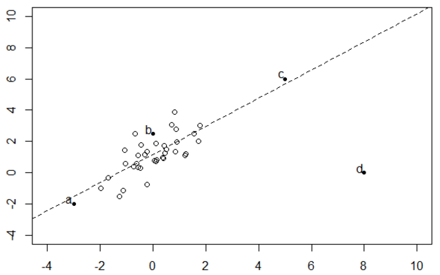

删除 a，b，c，d 哪个点对拟合回归线的影响最大？


  A. a


  B. b


  C. c


  D. d


  答案：D


  解析：线性回归对数据中的离群点比较敏感。虽然 c 点也是离群点，但它接近与回归线，残差较小。因此，d 点对拟合回归线的影响最大。

### 56. 在一个简单的线性回归模型中（只有一个变量），如果将输入变量改变一个单位（增加或减少），那么输出将改变多少？


  A. 一个单位


  B. 不变


  C. 截距


  D. 回归模型的尺度因子


  答案：D


  解析：很简单，假设线性回归模型是：y=a+bx，若 x 改变一个单位，例如 x+1，则 y 改变 b 个单位。b 是回归模型的尺度因子。

### 57. 逻辑回归将输出概率限定在 [0,1] 之间。下列哪个函数起到这样的作用？


  A. Sigmoid 函数


  B. tanh 函数


  C. ReLU 函数


  D. Leaky ReLU 函数


  答案：A


  解析：Sigmoid 函数的表达式和图形如下所示：

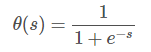

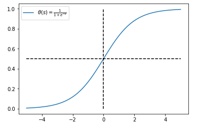

Sigmoid 函数输出值限定在 [0,1] 之间。

  tanh 函数：

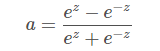

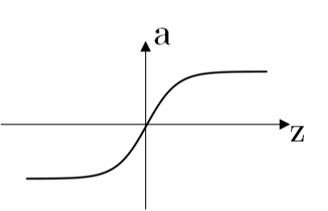

  ReLU 函数：

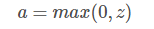

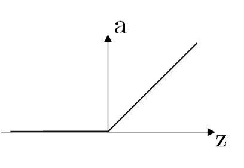

  Leaky ReLU 函数：

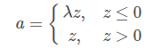

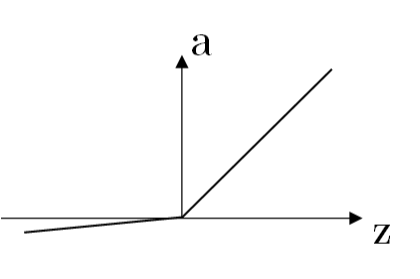

其中，λ 为可变参数，例如 λ=0.01。

### 58. 线性回归和逻辑回归中，关于损失函数对权重系数的偏导数，下列说法正确的是？


  A. 两者不一样


  B. 两者一样


  C. 无法确定


  答案：B


  解析：线性回归的损失函数为：

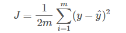

  逻辑回归的损失函数为：

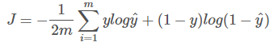

  逻辑回归输出层包含了 Sigmoid 非线性函数，其损失函数对 Sigmoid 函数之前的线性输出 Z 的偏导数与线性回归的损失函数对线性输出 Z 的偏导数一样，都是：

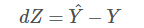

  具体推导过程比较简单，此处省略。


  dZ 是一样的，反向求导过程中，对所有权重系数的偏导数表达式都是一样的。

### 59. 假设使用逻辑回归进行 n 多类别分类，使用 One-vs-rest 分类法。下列说法正确的是？


  A. 对于 n 类别，需要训练 n 个模型


  B. 对于 n 类别，需要训练 n-1 个模型


  C. 对于 n 类别，只需要训练 1 个模型


  D. 以上说法都不对


  答案：A


  解析：One-vs-rest 分类法中，假设有 n 个类别，那么就会建立 n 个二项分类器，每个分类器针对其中一个类别和剩余类别进行分类。进行预测时，利用这 n个二项分类器进行分类，得到数据属于当前类的概率，选择其中概率最大的一个类别作为最终的预测结果。


  举个简单的例子，3 分类，类别分别是 {-1, 0, 1}。构建 3 个 二分类器：

```
      -1 与 0，1

      0 与 -1，1

      1 与 -1，0
```

  若第 1 个二分类器得到 -1 的概率是 0.7，第 2 个二分类器得到 0 的概率是 0.2，第 3 个二分类器得到 1 的 概率是 0.4，则最终预测的类别是 -1。

### 60. 下图是两个不同 β0、β1 对应的逻辑回归模型（绿色和黑色）：

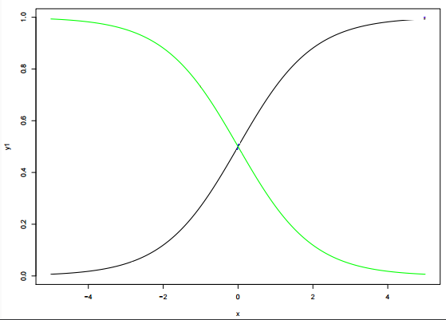

  关于两个逻辑回归模型中的 β0、β1 值，下列说法正确的是？


  注意：y= β0+β1*x， β0 是截距，β1 是权重系数。


  A. 绿色模型的 β1 比黑色模型的 β1 大


  B. 绿色模型的 β1 比黑色模型的 β1 小


  C. 两个模型的 β1 相同


  D. 以上说法都不对


  答案：B


  解析：逻辑回归模型最终还要经过 Sigmoid 非线性函数，Sigmoid 是增函数，其图形与上图中的黑色模型相近。黑色模型是增函数，说明其 β1>0，绿色模型是减函数，说明其 β1<0。所以，得出结论：绿色模型的 β1 比黑色模型的 β1 小。

### 61. 在 n 维空间中（n > 1），下列哪种方法最适合用来检测异常值？


  A. 正态概率图


  B. 箱形图


  C. 马氏距离


  D. 散点图


  答案：C


  解析：正态概率图（Normal Probability Plot）一般用来检查一组数据是否服从正态分布。是实数与正态分布数据之间函数关系的散点图。如果这组实数服从正态分布，正态概率图将是一条直线。如下图所示：


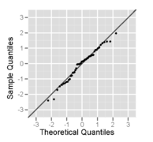

  箱形图（Box Plot），是一种用作显示一组数据分散情况资料的统计图。因型状如箱子而得名。如下图所示：

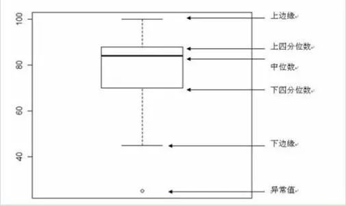

  散点图（Scatter Plot）是描述离散数据点的空间分布。


  马氏距离（Mahalonobis distance）多用来计算某样本点与数据集的距离，优点是具有尺度无关性。马氏距离的计算公式如下：


  其中，μ 是样本集均值，S 是样本集协方差矩阵。我们注意到马氏距离的公式与欧式距离公式只是多了一个协方差矩阵的逆。这也正是马氏距离的优点之处，它考虑了不同特征之间的协方差不同，将其进行归一化，使得距离度量与尺度无关。


  举个简单的例子来说明，假如 A 的身高体重为（170，60000），B 的身高体重为（170，61000），C 的身高体重是（160，60000），其中身高体重的单位分别是 cm、g。按照常理来说，A 和 B 的体型是比较相近的，但是如果使用欧式距离，计算得到 A 和 C 比较相近。原因在于身高维度的方差较小，而体重维度的方差较大。马氏距离恰恰消除了各个维度方差不同的影响，把方差归一化，使得特征之间的关系更加符合实际情况。


  因此，马氏距离更适合来判断样本点与数据集的位置关系，判断其是否离群。正态概率图、箱形图、散点图都比较直观，容易判断出错。

### 62. 逻辑回归与多元回归分析有哪些不同之处？


  A. 逻辑回归用来预测事件发生的概率


  B. 逻辑回归用来计算拟合优度指数


  C. 逻辑回归用来对回归系数进行估计


  D. 以上都是


  答案：D


  解析：A 选项，逻辑回归是用来解决分类问题的，可以用于预测事件发生的概率。


  B 选项，一般来说，为了测量真实样本与模型的拟合程度，可以使用逻辑回归来计算拟合优度指数。


  C 选项，在拟合逻辑回归模型之后，我们还可以根据系数值，来判断各个独立特征与目标输出的关系（正相关或负相关）。

### 63. 下列关于 bootstrap 说法正确的是？


  A. 从总的 M 个特征中，有放回地抽取 m 个特征（m < M）


  B. 从总的 M 个特征中，无放回地抽取 m 个特征（m < M）


  C. 从总的 N 个样本中，有放回地抽取 n 个样本（n < N）


  D. 从总的 N 个样本中，无放回地抽取 n 个样本（n < N）


  答案：C


  解析：bootstrap 的思想是从已有的数据集中模拟出类似但又不完全一样的数据集。主要是针对没有足够数据来训练多个模型的情况。


  bootstrap 的做法是，假设有 N 笔资料 D，先从中选出一个样本，再放回去，再选择一个样本，再放回去，共重复 n 次。这样我们就得到了一个新的 n 笔资料 D'，这个新的数据集中可能包含原数据集里的重复样本点，也可能没有原数据集里的某些样本，D' 与 D 类似但又不完全相同。值得一提的是，抽取-放回的操作次数不一定非要是 N，次数可以任意设定。例如原始样本有 10000 个，我们可以抽取-放回 3000 次，得到包含 3000 个样本的 D' 也是完全可以的。

### 64. "监督式学习中存在过拟合，而对于非监督式学习来说，没有过拟合"，这句话是否正确？


  A. 正确


  B. 错误


  答案：B


  解析：对于非监督式学习，仍然可能存在过拟合。一般来说，评估非监督式学习的指标也有很多，例如使用调整兰德指数（Adjusted Rand Score）来评估聚类模型。


  聚类模型中，假设实际类别信息为 C，聚类结果为 K，a 表示在 C 与 K 中都是同类别的元素有几对，b 表示在 C 与 K 中都是不同类别的元素有几对，则兰德指数为：


  RI 取值范围为 [0,1]，值越大意味着聚类结果与真实情况越吻合。


  但是，在聚类结果随机的情况下，RI 并不为 0。因此，为了解决这一问题，调整兰德指数（Adjusted Rand Score）被提出，它具有更高的区分度：


  ARI 取值范围为 [−1,1]，值越大意味着聚类结果与真实情况越吻合。从广义的角度来讲，ARI 衡量的是两个数据分布的吻合程度。

### 65. 关于 k 折交叉验证，下列说法正确的是？


  A. k 值并不是越大越好，k 值过大，会降低运算速度


  B. 选择更大的 k 值，会让偏差更小，因为 k 值越大，训练集越接近整个训练样本


  C. 选择合适的 k 值，能减小验方差


  D. 以上说法都正确


  答案： D


  解析：机器学习中，在样本量不充足的情况下，为了充分利用数据集对算法效果进行测试，将数据集随机分为 k 个包，每次将其中一个包作为测试集，剩下 k-1 个包作为训练集进行训练。


  k 折交叉验证的的 k 值不能太大，也不能太小。k 值过大，会降低运算速度。若 k 与样本数量 N 相同，则是留一法（Leave-One-Out）。k 值较大，训练集越接近整个训练样本，有利于减小模型偏差（bias）。一般可以将 k 作为超参数调试，根据表现选择合适的 k 值。


  k 折交叉验证能够有效提高模型的学习能力，类似于增加了训练样本数量，使得学习的模型更加稳健，鲁棒性更强。选择合适的 k 值能够有效避免过拟合。

### 66. 如果回归模型中存在多重共线性（multicollinearity），应该如何解决这一问题而不丢失太多信息（多选）？


  A. 剔除所有的共线性变量


  B. 剔除共线性变量中的一个


  C. 通过计算方差膨胀因子（Variance Inflation Factor，VIF）来检查共线性程度，并采取相应措施


  D. 删除相关变量可能会有信息损失，我们可以不删除相关变量，而使用一些正则化方法来解决多重共线性问题，例如 Ridge 或 Lasso 回归。


  答案：BCD


  解析：如果回归模型中存在共线性变量，那么可以采取相应措施，剔除共线性变量中的一个。为了检验多重共线性，我们可以创建一个相关矩阵来识别和去除相关度在 75% 以上的变量（阈值大小可人为设置）。此外，我们可以使用计算方差膨胀因子（VIF）来检查多重共线性的存在。若 VIF <= 4 则没有多重共线性，若 VIF＞10 值意味着严重的多重共线性。此外，我们可以使用容忍度作为多重共线性的指标。


  方差膨胀因子（Variance Inflation Factor，VIF）：是指解释变量之间存在多重共线性时的方差与不存在多重共线性时的方差之比。VIF 跟容忍度是倒数关系。详细介绍可自行查阅统计学资料。


  但是，去除相关变量可能导致信息的丢失。为了保留这些变量，我们可以使用正则化来“惩罚”回归模型，如 Ridge 和 Lasso 回归。此外，我们可以添加一些随机噪声相关变量，使变量变得彼此不同。但是，增加噪声可能会影响预测精度，因此应该谨慎使用这种方法。

### 67. 评估完模型之后，发现模型存在高偏差（high bias），应该如何解决？


  A. 减少模型的特征数量


  B. 增加模型的特征数量


  C. 增加样本数量


  D. 以上说法都正确


  答案：B


  解析：如果模型存在高偏差（high bias），意味着模型过于简单。为了使模型更加健壮，我们可以在特征空间中添加更多的特征。而添加样本数量将减少方差。


### 68. 在构建一个决策树模型时，我们对某个属性分割节点，下面四张图中，哪个属性对应的信息增益最大？


  A. outlook


  B. humidity


  C. windy


  D. temperature


  答案：A


  解析：李航的《统计学习方法》中，对信息增益有如下定义：特征 A 对训练数据集 D 的信息增益 g(D,A)，定义为集合 D 的经验熵 H(D) 与特征 A 给定条件下 D 的经验条件熵 H(D|A) 之差，即


  g(D,A) = H(D) - H(D|A)


  这一题，我们先计算经验熵 H(D)：
```
  H(D) = -9/14 * log(9/14) - 5/14 * log(5/14)

          = 0.6518
```

  图一中，经验条件熵 H(D|A) 为：


  H(D|A) = 5/14 * (-2/5*log(2/5)-3/5*log(3/5))
```
             + 4/14 * (-1*log(1)-0)

             + 5/14 * (-3/5*log(3/5)-2/5*log(2/5))

             = 0.4807
```
  图一的信息增益为：


  g(D,A) = H(D) - H(D|A) = 0.6518 - 0.4807

             = 0.1711


  图二中，经验条件熵 H(D|A) 为：


  H(D|A) = 7/14 * (-3/7*log(3/7)-4/7*log(4/7))

             + 7/14 * (-6/7*log(6/7)-1/7*log(1/7))

             = 0.5465


  图二的信息增益为：


  g(D,A) = H(D) - H(D|A) = 0.6518 - 0.5465

             = 0.1053


  图三中，经验条件熵 H(D|A) 为：


  H(D|A) = 8/14 * (-6/8*log(6/8)-2/8*log(2/8))

             + 6/14 * (-3/6*log(3/6)-3/6*log(3/6))

             = 0.6184


  图三的信息增益为：


  g(D,A) = H(D) - H(D|A) = 0.6518 - 0.6184

             = 0.0334


  图四中，经验条件熵 H(D|A) 为：


  H(D|A) = 4/14 * (-2/4*log(2/4)-2/4*log(2/4))

             /+ 6/14 * (-4/6*log(4/6)-2/6*log(2/6))

             /+ 4/14 * (-3/4*log(3/4)-1/4*log(1/4))

             = 0.6315


  图四的信息增益为：


  g(D,A) = H(D) - H(D|A) = 0.6518 - 0.6315

             = 0.0203


  显然，图一 outlook 对应的信息增益最大。

### 69. 在决策树分割结点的时候，下列关于信息增益说法正确的是（多选）？


  A. 纯度高的结点需要更多的信息来描述它


  B. 信息增益可以用”1比特-熵”获得


  C. 如果选择一个属性具有许多特征值, 那么这个信息增益是有偏差的


  答案： BC

### 70. 如果一个 SVM 模型出现欠拟合，那么下列哪种方法能解决这一问题？


  A. 增大惩罚参数 C 的值


  B. 减小惩罚参数 C 的值


  C. 减小核系数（gamma参数）


  答案：A


  解析：SVM模型出现欠拟合，表明模型过于简单，需要提高模型复杂度。


  Soft-Margin SVM 的目标为：


  C 值越大，相应的模型月复杂。接下来，我们看看 C 取不同的值时，模型的复杂程度。


  从上图可以看出，C=1 时，模型比较简单，分类错误的点也比较多，发生欠拟合。当 C 越来越大的时候，模型越来越复杂，分类错误的点也在减少。但是，当 C 值很大的时候，虽然分类正确率提高，但很可能把 noise 也进行了处理，从而可能造成过拟合。


  而对于 SVM 的核函数，同样，核系数越大，模型越复杂。举个例子，核系数分别取 1, 10, 100 时对应的分类效果如下：


  从图中可以看出，当核系数比较小的时候，分类线比较光滑。当核系数越来越大的时候，分类线变得越来越复杂和扭曲，直到最后，分类线变成一个个独立的小区域。为什么会出现这种区别呢？这是因为核系数越大，其对应的核函数越尖瘦，那么有限个核函数的线性组合就比较离散，分类效果并不好。所以， SVM 也会出现过拟合现象，核系数的正确选择尤为重要，不能太小也不能太大。

### 71. 假设我们在支持向量机（SVM）算法中对 Gamma（RBF 核系数 γ）的不同值进行可视化。由于某种原因，我们忘记了标记伽马值的可视化。令 g1、g2、g3 分别对应着下面的图 1、图 2 和图 3。则关于 g1、g2、g3 大小下列说法正确的是？


  A. g1 > g2 > g3


  B. g1 = g2 = g3


  C. g1 < g2 < g3


  D. g1 > g2 = g3


  E. g1 < g2 = g3


  答案：C


  解析：本题考查的是 Kernel SVM 中 Gamma γ 对模型形状的影响。


  SVM 中为了得到更加复杂的分类面并提高运算速度，通常会使用核函数的技巧。径向基核函数（RBF）也称为高斯核函数是最常用的核函数，其核函数的表达式如下所示：


  形式与高斯分布类似，Gamma γ 是高斯分布中标准差 Sigma σ 的导数。我们知道在高斯分布中，σ 越小，对应的高斯曲线就越尖瘦。也就是说 γ 越大，高斯核函数对应的曲线就越尖瘦。这样，运用核技巧得到的 SVM 分类面就更加曲折复杂，甚至会将许多样本隔离成单个的小岛。


  下面是 γ 分别取 1、10、100 时对应的 SVM 分类效果：


  值得一提的是，γ 过小容易造成欠拟合，γ 过大容易造成过拟合。

### 72. 我们知道二元分类的输出是概率值。一般设定输出概率大于或等于 0.5，则预测为正类；若输出概率小于 0.5，则预测为负类。那么，如果将阈值 0.5 提高，例如 0.6，大于或等于 0.6 的才预测为正类。则准确率（Precision）和召回率（Recall）会发生什么变化（多选）？


  A. 准确率（Precision）增加或者不变


  B. 准确率（Precision）减小


  C. 召回率（Recall）减小或者不变


  D. 召回率（Recall）增大


  答案：AC


  解析：本题考察的是二元分类阈值提高对准确率和召回率的影响。


  首先来看一下什么是准确率和召回率，下面分别用 P 和 R 代表。以一个简单的例子来说明，例如预测 20 个西瓜中哪些是好瓜，这 20 个西瓜中实际有 15 个好瓜，5 个坏瓜。某个模型预测的结果是：16 个好瓜，4 个坏瓜。其中，预测的 16 个好瓜中有 14 个确实是好瓜，预测的 4 个坏瓜中有 3 个确实是坏瓜。下面以一张图表说明：
<table>
<tr>
<th>
</th>
<th>
真实好瓜 P
</th>
<th>
真实坏瓜 N
</th>
</tr>
<tr>
<td>
预测好瓜 P
</td>
<td>
TP = 14
</td>
<td>
FP = 2
</td>
</tr>
<tr>
<td>
预测坏瓜 N
</td>
<td>
FN = 1
</td>
<td>
TN = 3
</td>
</tr>
</table>

  这样，准确率 P 的定义是：


  可以理解为预测好瓜中，确实是好瓜的比例。该例子中 P = 14/(14+2)。


  召回率 R 的定义是：


  可以理解为真实的好瓜被预测出来的比例。该例子中 R = 14/(14+1)。


  现在，如果二元分类阈值提高，相当于判定好瓜的标准更严格了。所以可能会造成预测是好瓜的数目减少，即 TP 和 FP 均减小。因此准确率可能会增加，极端的，苛刻条件，只预测一个是好瓜，那该瓜是好瓜的概率会很大，即准确率很高。但是 15 个好瓜你只挑出来 1 个，召回率就降低了。


  准确率和召回率都不能很好地反映模型性能，通常使用 F1 score 来作为模型预测水平判据。F1 Score 被定义为准确率和召回率的调和平均数。，如下所示：


### 73. 点击率预测是一个正负样本不平衡问题（例如 99% 的没有点击，只有 1% 点击）。假如在这个非平衡的数据集上建立一个模型，得到训练样本的正确率是 99%，则下列说法正确的是？


  A. 模型正确率很高，不需要优化模型了


  B. 模型正确率并不高，应该建立更好的模型


  C. 无法对模型做出好坏评价


  D. 以上说法都不对


  答案：B


  解析：这一题延续了上题中准确率和召回率的知识点，考查了正负样本分布不均问题。


  模型训练过程中正负样本分布不均是常见的问题。这时候不能单独只看预测正确率。对于此题来说，如果我们预测的结果是 100% 没有点击，0% 点击，那么可以说正确率是 99%，因为只有 1% 的点击预测错误。但是，我们其实更关心的那 1% 的点击率并没有预测出来。可以说这样的模型是没有任何意义的。


  对应正负样本不平衡的情况需要做一些数据处理，主要包括：采样、数据合成、惩罚因子加权、一分类。其中，一分类即是在正负样本分布极不平衡的时候，把它看做一分类（One Class Learning）或异常检测（Novelty Detection）问题。这类方法的重点不在于捕捉类间的差别，而是为其中一类进行建模，经典的工作包括 One-class SVM 等。

### 74. 假设我们使用 kNN 训练模型，其中训练数据具有较少的观测数据（下图是两个属性 x、y 和两个标记为 “+” 和 “o” 的训练数据）。现在令 k = 1，则图中的 Leave-One-Out 交叉验证错误率是多少？


  A. 0%


  B. 20%


  C. 50%


  D. 100%


  答案：D


  解析：本题考查的是 kNN 算法和 Leave-One-Out 交叉验证。


  kNN 算法是标记类算法，取当前实例最近邻的 k 个样本，k 个样本中所属的最多类别即判定为该实例的类别。本题中 k = 1，则只需要看最近邻的那一个样本属于“+” 还是“o”即可。


  Leave-One-Out 交叉验证是一种用来训练和测试分类器的方法，假定数据集有N 个样本，将这个样本分为两份，第一份 N-1 个样本用来训练分类器，另一份 1 个样本用来测试，如此迭代 N 次，所有的样本里所有对象都经历了测试和训练。


  分别对这 10 个点进行观察可以发现，每个实例点最近邻的都不是当前实例所属的类别，因此每次验证都是错误的。整体的错误率即为 100%。

### 75. 如果在大型数据集上训练决策树。为了花费更少的时间来训练这个模型，下列哪种做法是正确的？


  A. 增加树的深度


  B. 增加学习率


  C. 减小树的深度


  D. 减少树的数量


  答案：C


  解析：本题考查的是决策树相关概念。


  一般用决策树进行分类，从根结点开始，对实例的某一特征进行测试，根据测试结果，将实例分配到其子结点。这时，每一个子结点对应着该特征的一个取值。如此递归地对实例进行测试并分类，直至达到叶结点。最后将实例分到叶结点的类中。—— 引自李航 《统计学习方法》


  决策树深度越深，在训练集上误差会越小，准确率越高。但是容易造成过拟合，而且增加模型的训练时间。对决策树进行修剪，减小树的深度，能够提高模型的训练速度，有效避免过拟合。


  单决策树中，学习率不是一个有效参数。


  决策树是单树，随机森林由多个决策树组成。

### 76. 关于神经网络，下列说法正确的是？


  A. 增加网络层数，可能会增加测试集分类错误率


  B. 增加网络层数，一定会增加训练集分类错误率


  C. 减少网络层数，可能会减少测试集分类错误率


  D. 减少网络层数，一定会减少训练集分类错误率


  答案：AC


  解析：本题考查的是神经网络层数对训练误差和测试误差的影响。


  一般来说，神经网络层数越多，模型越复杂，对数据的分类效果越好。所以，从最简单的层数开始，增加网络层数都能使得训练误差和测试误差减小。但是，神经网络层数过多容易造成过拟合，即对训练样本分类效果很好，误差小，但是测试误差很大。


  为了避免发生过拟合，应该选择合适的神经网络层数并使用正则化技术来让神经网络更加稳健。

### 77. 假设我们使用原始的非线性可分版本的 Soft-SVM 优化目标函数。我们需要做什么来保证得到的模型是线性可分离的？


  A. C = 0


  B. C = 1


  C. C 正无穷大


  D. C 负无穷大


  答案：C


  解析：本题考查的是 SVM 和 Soft-SVM 之间的联系和彼此转化条件。


  Soft-SVM 在原来的 SVM 基础上增加了分类错误项，如下式：


  其中，第二项即为分类错误项。C 为参数类似于正则化中的惩罚因子。其中， ξn 表示每个点犯错误的程度，ξn = 0，表示没有错误，ξn 越大，表示错误越大，即点距离边界（负的）越大。参数 C 表示尽可能选择宽边界和尽可能不要犯错两者之间的权衡，因为边界宽了，往往犯错误的点会增加。large C 表示希望得到更少的分类错误，即不惜选择窄边界也要尽可能把更多点正确分类；small C 表示希望得到更宽的边界，即不惜增加错误点个数也要选择更宽的分类边界。因此，C 正无穷大时，可以实现没有分类错误的点，模型线性可分。

  从另一方面来看，线性可分 SVM 中，对偶形式解得拉格朗日因子 αn≥0；而在 Soft-SVM 中，对偶形式解得拉格朗日因子 0 ≤ αn ≤ C。显然，当 C 无正无穷大的时候，两者形式相同。

  值得一提的是，当 C 值很大的时候，虽然分类正确率提高，但很可能把 noise 也进行了处理，从而可能造成过拟合。也就是说 Soft-SVM 同样可能会出现过拟合现象，所以参数 C 的选择非常重要。下图是 C 分别取1、10、100时，相应的分类曲线：


### 78. 在训练完 SVM 之后，我们可以只保留支持向量，而舍去所有非支持向量。仍然不会影响模型分类能力。这句话是否正确？


  A. 正确


  B. 错误


  答案：A

  解析：本题考查的是对支持向量机 SVM 的概念理解。

  其实，刚学习支持向量机时会有个疑问，就是为什么会叫这个名字。该算法决定分类面的一般是关键的几个点，这几个点构建了分类面，因此被称为支持向量。该算法也就叫支持向量机了。训练完毕之后，其它非支持向量对分类面并无影响，去掉无妨。

  对于线性可分的 SVM，可以根据拉格朗日因子 αn 数值来判断当前样本 (xn, yn) 是否为 SV。

    - 若 αn = 0：不是 SV

    - 若 αn > 0：是 SV，且分类正确


  对于 Soft-SVM（线性不可分），可以根据拉格朗日因子 αn 数值与参数 C 的关系来判断当前样本 (xn, yn) 是否为 SV。

      - 若 αn = 0：不是 SV，且分类正确

      - 若 0 < αn < C：是 SV

      - 若 αn = C：不是 SV，且分类错误（或恰好位于分类面上）


  对 SVM 概念不太清楚的同学可以看看林轩田机器学习技法 1-6 对 SVM 的讲解，通俗易懂，内容翔实。对应的笔记可以在本公众号查阅，放上第 1 讲链接：

[深入浅出机器学习技法（一）：线性支持向量机](https://mp.weixin.qq.com/s?__biz=MzIwOTc2MTUyMg==&mid=2247483942&idx=1&sn=564b65607d2e682bdedfdba51296a80e&chksm=976fa7bba0182ead76a6a22cf4d720efa281287c710beeb9304fc59057356029d8c7c2fac4f3&scene=21#wechat_redirect)

### 79. 下列哪些算法可以用来够造神经网络（多选）？


  A. kNN


  B. 线性回归


  C. 逻辑回归


  答案：BC


  解析：本题考查的是 kNN、线性回归、逻辑回归与神经网络之间的一些关系。


  kNN 是一种基于实例的学习算法，不具有任何训练参数。因此不能用来构造神经网络。


  线性回归和逻辑回归都可以用来构造神经网络模型，其实二者就是单神经元的神经网络。

### 80. 下列数据集适用于隐马尔可夫模型的是？


  A. 基因数据


  B. 影评数据


  C. 股票市场价格


  D. 以上所有


  答案：D


  解析：本题考查的是隐马尔可夫模型适用于解决哪类问题。


  隐马尔可夫模型（Hidden Markov Model，HMM）是关于时序的概率模型，描述一个隐藏的马尔可夫链随机生成不可观测的状态随机序列，再由各个状态生成一个观察而产生观测随机序列的过程。因此，隐马尔可夫模型适用于解决时间序列问题。

### 81. 我们想要训练一个 ML 模型，样本数量有 100 万个，特征维度是 5000，面对如此大数据，如何有效地训练模型（多选）？

  A. 对训练集随机采样，在随机采样的数据上建立模型

  B. 尝试使用在线机器学习算法

  C. 使用 PCA 算法减少特征维度

  答案：ABC

  解析：本题考查的是如何解决样本数量和特征维度过大的问题。

  在有限的内存下，如何处理高特征纬度的训练样本是一项非常艰巨的任务。下面这些方法可以用来解决这一问题。

      我们可以随机抽样数据集，包括样本数量和特征数量。这意味着，我们可以创建一个更小的数据集，比如说，有 1000 个特征和 300000 个样本进行训练。

      使用在线学习（online learning）算法

      使用主成分分析算法（PCA）挑选有效的特征，去除冗余特征。

  关于在线学习与离线学习，离线学习是我们最为常见的一种机器学习算法模式，使用全部数据参与训练。训练完成，整个模型就确定了；而在线学习一般每次使用一个数据或是小批量数据进行训练，每次训练都会优化模型，模型处于不断优化更改状态。  

  PCA(principal Component Analysis)，是一种使用最广泛的数据压缩算法。在PCA中，数据从原来的坐标系转换到新的坐标系，由数据本身决定。转换坐标系时，以方差最大的方向作为坐标轴方向，因为数据的最大方差给出了数据的最重要的信息。第一个新坐标轴选择的是原始数据中方差最大的方法，第二个新坐标轴选择的是与第一个新坐标轴正交且方差次大的方向。重复该过程，重复次数为原始数据的特征维数。

  什么是冗余特征呢？比如汽车数据中，里面既有以“千米/每小时”度量特征，也有“英里/小时”的特征，显然这两个特征有一个是多余的。

### 82. 我们希望减少数据集中的特征数量。你可以采取以下哪一个步骤来减少特征（多选）？

  A. 使用正向选择法（Forward Selection）


  B. 使用反向消除法（Backward Elimination）


  C. 逐步选择消除法（Stepwise）


  D. 计算不同特征之间的相关系数，删去相关系数高的特征之一


  答案：ABCD

  解析：本题考查的是机器学习模型中特征选择问题。

  正向选择（Forward Selection）是首先选择一个特征，每个特征都试一遍，选择对模型准确率提升最高的那个特征；然后再在这个特征基础上添加另外一个特征，方法类似，直到模型准确率不再提示为止。

  反向消除（Backward Elimination）是首先包含了所有的特征，然后尝试删除每个特征，最终删掉对模型准确率提升最高的一个特征（因为删除这个特征，模型准确率反而增加了，说明是无用特征）。如此类推，直到删除特征并不能提升模型为止。

  相对于 Forward Selection，Backward Elimination 的优点在于其允许一些低贡献值的特征能够进到模型中去(有时候低贡献值的特征能在组合中有更大的贡献值，而 Forward Selection 忽略了这种组合的可能性)，因此Backward Elimination能够避免受一两个占主导地位的特征的干扰。

  另外还有一种特征选择方法是 Stepwise，该方法结合上述两者的方法，新加入一个特征之后，再尝试删去一个特征，直至达到某个预设的标准。这种方法的缺点是，预设的标准不好定，而且容易陷入到过拟合当中。

  除此之外，也可以使用基于相关性的特征选择，可以去除多重线性特征。例如上一题中“千米/每小时”和“英里/小时”是相关性很大的特征，可删其一。

### 83. 下面关于 Random Forest 和 Gradient Boosting Trees 说法正确的是？

  A. Random Forest 的中间树不是相互独立的，而 Gradient Boosting Trees 的中间树是相互独立的


  B. 两者都使用随机特征子集来创建中间树


  C. 在 Gradient Boosting Trees 中可以生成并行树，因为它们是相互独立的


  D. 无论任何数据，Gradient Boosting Trees 总是优于 Random Forest


  答案：B


  解析：本题考查的是随机森林和梯度提升树（GBDT）的基本概率和区别。


  Random Forest 是基于 Bagging 的，而 Gradient Boosting Trees 是基于 Boosting 的。Bagging 和 Boosting 的区别在于：


  1）样本选择上：

  Bagging：训练集是在原始集中有放回选取的，从原始集中选出的各轮训练集之间是独立的。

  Boosting：每一轮的训练集不变，只是训练集中每个样例在分类器中的权重发生变化。而权值是根据上一轮的分类结果进行调整。


  2）样例权重：

  Bagging：使用均匀取样，每个样例的权重相等。

  Boosting：根据错误率不断调整样例的权值，错误率越大则权重越大。


  3）预测函数：

  Bagging：所有预测函数的权重相等。

  Boosting：每个弱分类器都有相应的权重，对于分类误差小的分类器会有更大的权重。


  4）并行计算：

  Bagging：各个预测函数可以并行生成。

  Boosting：各个预测函数只能顺序生成，因为后一个模型参数需要前一轮模型的结果。


  因此，Gradient Boosting Trees 的中间树不是相互独立的，因为前一棵树的结果影响下一棵树。Random Forest 的中间树相互独立，因此可以并行生成这些树。


  在这两种算法中，我们使用随机特征集来生成中间树。


  Gradient Boosting Trees 并不总比 Random Forest 好，依赖于数据。

### 84. “对于 PCA 处理后的特征，其朴素贝叶斯特征相互独立的假设一定成立，因为所有主成分都是正交的，所以不相关”。这句话是否正确？


  A. True


  B. False


  答案：B


  解析：本题考查的是 PCA 和 朴素贝叶斯的基本概率和区别。


  这句话有两处错误：一是 PCA 转换之后的特征不一定不相关；二是不相关并不等价于相互独立。


  正交和不相关没有必然关系，只有当一个随机变量的统计平均等于零时，正交和不相关等价。


  独立则必定不相关，而不相关却不一定互相独立，只有是高斯时独立和不相关才等价。

### 85. 下列关于 PCA 说法正确的是（多选）？


  A. 在使用 PCA 之前，我们必须标准化数据


  B. 应该选择具有最大方差的主成分


  C. 应该选择具有最小方差的主成分


  D. 可以使用 PCA 在低维空间中可视化数据


  答案：ABD


  解析：本题考查的是主成分分析（PCA）的基本概念和推导原理。


  PCA 对数据中变量的尺度非常敏感，因此我们需要对各个变量进行标准化。方法是减去各自变量的均值，除以标准差。


  举个例子，假如某个变量单位从 km 改成 cm，大大增加了其方差，那么该变量可能就成为了主成分。这是我们不希望看大的。


  B 是正确的，因为我们总是选择方差最大的主成分。可以这么来理解，方差越大，说明在该特征上分布越广泛，说明该特征月有用，影响越大。


  PCA 有时在较低维度上绘制数据是非常有用。例如我们可以提取前 2 个主要组成部分，然后在二维平面上使用散点图可视化数据。

### 86. 下图中，主成分的最佳数目是多少？


  A. 10


  B. 20


  C. 30


  D. 无法确定


  答案：C


  解析：本题考查的是 PCA 的基本概念。


  显然，当主成分数目为 30 的时候，积累的方差比例最大。

### 87. 数据科学家经常使用多个算法进行预测，并将多个机器学习算法的输出（称为“集成学习”）结合起来，以获得比所有个体模型都更好的更健壮的输出。则下列说法正确的是？


  A. 基本模型之间相关性高


  B. 基本模型之间相关性低


  C. 集成方法中，使用加权平均代替投票方法


  D. 基本模型都来自于同一算法


  答案：B


  解析：本题考查的是集成学习的基本原理。

  集成学习，顾名思义，通过将多个单个学习器集成/组合在一起，使它们共同完成学习任务。

  举个例子来说明，假如你有 T 个朋友，每个朋友向你预测推荐明天某支股票会涨还是会跌，那么你该选择哪个朋友的建议呢？第一种方法是从 T 个朋友中选择一个最受信任，对股票预测能力最强的人，直接听从他的建议就好。这是一种普遍的做法，对应的就是 validation 的思想，即选择犯错误最小的模型。第二种方法，如果每个朋友在股票预测方面都是比较厉害的，都有各自的专长，那么就同时考虑 T 个朋友的建议，将所有结果做个投票，一人一票，最终决定出对该支股票的预测。这种方法对应的是 uniformly 思想。第三种方法，如果每个朋友水平不一，有的比较厉害，投票比重应该更大一些，有的比较差，投票比重应该更小一些。那么，仍然对 T 个朋友进行投票，只是每个人的投票权重不同。这种方法对应的是 non-uniformly 的思想。第四种方法与第三种方法类似，但是权重不是固定的，根据不同的条件，给予不同的权重。比如如果是传统行业的股票，那么给这方面比较厉害的朋友较高的投票权重，如果是服务行业，那么就给这方面比较厉害的朋友较高的投票权重。以上所述的这四种方法都是将不同人不同意见融合起来的方式，这就是集成思想，即把多个基本模型结合起来，得到更好的预测效果。

  通常来说，基本模型之间的相关性越低越好，因为每个模型有各自的特长，集成起来才更加强大。

### 88. 如何在监督式学习中使用聚类算法（多选）？

  A. 首先，可以创建聚类，然后分别在不同的集群上应用监督式学习算法


  B. 在应用监督式学习算法之前，可以将其类别 ID 作为特征空间中的一个额外的特征


  C. 在应用监督式学习之前，不能创建聚类


  D. 在应用监督式学习算法之前，不能将其类别 ID 作为特征空间中的一个额外的特征


  答案：AB

  解析：本题考查的是聚类算法与监督式学习。

  我们可以为不同的集群构建独立的机器学习模型，并且可以提高预测精度。将每个类别的 ID 作为特征空间中的一个额外的特征可能会提高的精度结果。

### 89. 下面哪句话是正确的？


  A. 机器学习模型的精准度越高，则模型的性能越好


  B. 增加模型的复杂度，总能减小测试样本误差


  C. 增加模型的复杂度，总能减小训练样本误差


  D. 以上说法都不对


  答案：C

  解析：本题考查的是机器学习模型的评判指标。

  机器学习模型的精准度（Precision）越高，模型性能不一定越好，还要看模型的召回率（Recall），特别是在正负样本分布不均的情况下。一般使用 F1 score 评判标准。


  增加模型复杂度，通常可能造成过拟合。过拟合的表现是训练样本误差减小，而测试样本误差增大。

### 90. 关于 GBDT 算法，下列说法正确的是（多选）？

  A. 增加用于分割的最小样本数量，有助于避免过拟合


  B. 增加用于分割的最小样本数量，容易造成过拟合


  C. 减小每个基本树的样本比例，有助于减小方差


  D. 减小每个基本树的样本比例，有助于减小偏差


  答案：AC


  解析：本题考查的是 GBDT 的基本概念。

  节点中用于分割所需的最小样本数用来控制过拟合。过高的值可能导致欠拟合，因此，它应该使用交叉验证进行调整。

  每个基本树选择的样本比例是通过随机抽样来完成的。小于1的值能够减小方差使模型具有鲁棒性。典型值 0.8 通常工作良好，但可以进一步精细调整。

  GBDT 通过多轮迭代,每轮迭代产生一个弱分类器，每个分类器在上一轮分类器的残差基础上进行训练。对弱分类器的要求一般是足够简单，并且是低方差和高偏差的，因为训练的过程是通过降低偏差来不断提高最终分类器的精度。

### 91. 下面哪个对应的是正确的 KNN 决策边界？


  A. A

  B. B

  C. C

  D. D

  答案：A

  解析：本题考查的是 KNN 的相关知识点。

  KNN 分类算法是一个比较成熟也是最简单的机器学习(Machine Learning)算法之一。该方法的思路是：如果一个样本在特征空间中与K个实例最为相似(即特征空间中最邻近)，那么这 K 个实例中大多数属于哪个类别，则该样本也属于这个类别。其中，计算样本与其他实例的相似性一般采用距离衡量法。离得越近越相似，离得越远越不相似。因此，决策边界可能不是线性的。

### 92. 如果一个经过训练的机器学习模型在测试集上达到 100% 的准确率，这是否意味着该模型将在另外一个新的测试集上也能得到 100% 的准确率呢？


  A. 是的，因为这个模型泛化能力已经很好了，可以应用于任何数据


  B. 不行，因为还有一些模型不确定的东西，例如噪声


  答案：B

  解析：本题考查的是机器学习泛化能力与噪声。

  现实世界的数据并不总是无噪声的，所以在这种情况下，我们不会得到 100% 的准确度。

### 93. 下面是交叉验证的几种方法：


  1. Bootstrap


  2. 留一法交叉验证


  3. 5 折交叉验证


  4. 重复使用两次 5 折交叉验证


  请对上面四种方法的执行时间进行排序，样本数量为 1000。


  A. 1 > 2 > 3 > 4


  B. 2 > 4 > 3 > 1


  C. 4 > 1 > 2 >３


  D. 2 > 4 > 3 > 1


  答案：D


  解析：本题考查的是 k 折交叉验证和 Bootstrap 的基本概念。


  Bootstrap 是统计学的一个工具，思想就是从已有数据集 D 中模拟出其他类似的样本 Dt。Bootstrap 的做法是，假设有 N 笔资料，先从中选出一个样本，再放回去，再选择一个样本，再放回去，共重复 N 次。这样我们就得到了一个新的 N 笔资料，这个新的 Dt 中可能包含原 D 里的重复样本点，也可能没有原 D 里的某些样本，Dt 与 D 类似但又不完全相同。值得一提的是，抽取-放回的操作不一定非要是 N，次数可以任意设定。例如原始样本有 10000 个，我们可以抽取-放回 3000 次，得到包含 3000 个样本的 Dt 也是完全可以的。因此，使用 bootstrap 只相当于有 1 个模型需要训练，所需时间最少。


  留一法（Leave-One-Out）交叉验证每次选取 N-1 个样本作为训练集，另外一个样本作为验证集，重复 N 次。因此，留一法相当于有 N 个模型需要训练，所需的时间最长。


  5 折交叉验证把 N 个样本分成 5 份，其中 4 份作为训练集，另外 1 份作为验证集，重复 5 次。因此，5 折交叉验证相当于有 5 个模型需要训练。


  2 次重复的 5 折交叉验证相当于有 10 个模型需要训练。

### 94. 变量选择是用来选择最好的判别器子集， 如果要考虑模型效率，我们应该做哪些变量选择的考虑？（多选）


  A. 多个变量是否有相同的功能


  B. 模型是否具有解释性


  C. 特征是否携带有效信息


  D. 交叉验证


  答案：ACD


  解析：本题考查的是模型特征选择。


  如果多个变量试图做相同的工作，那么可能存在多重共线性，影响模型性能，需要考虑。如果特征是携带有效信息的，总是会增加模型的有效信息。我们需要应用交叉验证来检查模型的通用性。关于模型性能，我们不需要看到模型的可解释性。

### 95. 下面有关分类算法的准确率，召回率，F1 值的描述，错误的是？

  A.准确率是检索出相关文档数与检索出的文档总数的比率，衡量的是检索系统的查准率


  B.召回率是指检索出的相关文档数和文档库中所有的相关文档数的比率，衡量的是检索系统的查全率


  C.正确率、召回率和 F 值取值都在 0 和 1 之间，数值越接近 0，查准率或查全率就越高


  D.为了解决准确率和召回率冲突问题，引入了F1分数


  答案：C


  解析：对于二类分类问题常用的评价指标是精准度（precision）与召回率（recall）。通常以关注的类为正类，其他类为负类，分类器在测试数据集上的预测或正确或不正确，4种情况出现的总数分别记作：


  TP——将正类预测为正类数


  FN——将正类预测为负类数


  FP——将负类预测为正类数


  TN——将负类预测为负类数


  精准率定义为：P = TP / (TP + FP)


  召回率定义为：R = TP / (TP + FN)


  F1值定义为： F1 = 2PR / (P + R)


  精准率和召回率和 F1 取值都在 0 和 1 之间，精准率和召回率高，F1 值也会高，不存在数值越接近 0 越高的说法，应该是数值越接近 1 越高。

### 96. 如果在线性回归模型中额外增加一个变量特征之后，下列说法正确的是？

  A. R-Squared 和 Adjusted R-Squared 都会增大


  B. R-Squared 保持不变 Adjusted R-Squared 增加


  C. R-Squared 和 Adjusted R-Squared 都会减小


  D. 以上说法都不对


  答案：D


  解析：本题考查的是线性回归模型的评估准则 R-Squared 和 Adjusted R-Squared。


  线性回归问题中，R-Squared 是用来衡量回归方程与真实样本输出之间的相似程度。其表达式如下所示：


  上式中，分子部分表示真实值与预测值的平方差之和，类似于均方差 MSE；分母部分表示真实值与均值的平方差之和，类似于方差 Var。根据 R-Squared 的取值，来判断模型的好坏：如果结果是 0，说明模型拟合效果很差；如果结果是 1，说明模型无错误。一般来说，R-Squared 越大，表示模型拟合效果越好。R-Squared 反映的是大概有多准，因为，随着样本数量的增加，R-Square必然增加，无法真正定量说明准确程度，只能大概定量。


  单独看 R-Squared，并不能推断出增加的特征是否有意义。通常来说，增加一个特征，R-Squared 可能变大也可能保持不变，两者不一定呈正相关。


  如果使用校正决定系数（Adjusted R-Square）：


  其中，n 是样本数量，p 是特征数量。Adjusted R-Square 抵消样本数量对 R-Square的影响，做到了真正的 0~1，越大越好。若增加的特征有效，则 Adjusted R-Square 就会增大，反之则减小。

### 97. 如下图所示，对同一数据集进行训练，得到 3 个模型。对于这 3 个模型的评估，下列说法正确的是？（多选）


  A. 第一个模型的训练误差最大


  B. 第三个模型性能最好，因为其训练误差最小


  C. 第二个模型最稳健，其在测试集上表现应该最好


  D. 第三个模型过拟合


  答案：ACD


  解析：本题考查的是机器学习模型欠拟合、过拟合概念。


  很简单，第一个模型过于简单，发生欠拟合，训练误差很大，在训练样本和测试样本上表现都不佳。第二个模型较好，泛化能力强，模型较为健壮，在训练样本和测试样本上表现都不错。第三个模型过于复杂，发生过拟合，训练样本误差虽然很小，但是在测试样本集上一般表现很差，泛化能力很差。


  模型选择应该避免欠拟合和过拟合，对于模型复杂的情况可以选择使用正则化方法。

### 98. 如果使用线性回归模型，下列说法正确的是？

  A. 检查异常值是很重要的，因为线性回归对离群效应很敏感


  B. 线性回归分析要求所有变量特征都必须具有正态分布


  C. 线性回归假设数据中基本没有多重共线性


  D. 以上说法都不对


  答案：A


  解析：本题考查的是线性回归的一些基本原理。


  异常值是数据中的一个非常有影响的点，它可以改变最终回归线的斜率。因此，去除或处理异常值在回归分析中一直是很重要的。


  了解变量特征的分布是有用的。类似于正态分布的变量特征对提升模型性能很有帮助。例如，数据预处理的时候经常做的一件事就是将数据特征归一化到（0，1）分布。但这也不是必须的。


  当模型包含相互关联的多个特征时，会发生多重共线性。因此，线性回归中变量特征应该尽量减少冗余性。C 选择绝对化了。

### 99. 建立线性模型时，我们看变量之间的相关性。在寻找相关矩阵中的相关系数时，如果发现 3 对变量（Var1 和 Var2、Var2 和 Var3、Var3 和 Var1）之间的相关性分别为 -0.98、0.45 和 1.23。我们能从中推断出什么呢？（多选）


  A. Var1 和 Var2 具有很高的相关性


  B. Var1 和 Var2 存在多重共线性，模型可以去掉其中一个特征


  C. Var3 和 Var1 相关系数为 1.23 是不可能的


  答案：ABC


  解析：本题考查的是相关系数的基本概念。


  Var1 和 Var2 之间的相关性非常高，并且是负的，因此我们可以将其视为多重共线性的情况。此外，当数据中存在多重线性特征时，我们可以去掉一个。一般来说，如果相关大于 0.7 或小于 -0.7，那么我们认为特征之间有很高的相关性。第三个选项是不言自明的，相关系数介于 [-1,1] 之间，1.23 明显有误。

### 100. 如果自变量 X 和因变量 Y 之间存在高度的非线性和复杂关系，那么树模型很可能优于经典回归方法。这个说法正确吗？


  A. 正确


  B. 错误


  答案：A


  解析：本题考查的是回归模型的选择。


  当数据是非线性的时，经典回归模型泛化能力不强，而基于树的模型通常表现更好。


  参考文献：
><https://www.analyticsvidhya.com/blog/2016/12/45-questions-to-test-a-data-scientist-on-regression-skill-test-regression-solution/>  
<https://www.analyticsvidhya.com/blog/2016/11/solution-for-skilltest-machine-learning-revealed/>  <https://www.analyticsvidhya.com/blog/2017/04/40-questions-test-data-scientist-machine-learning-solution-skillpower-machine-learning-datafest-2017/>
